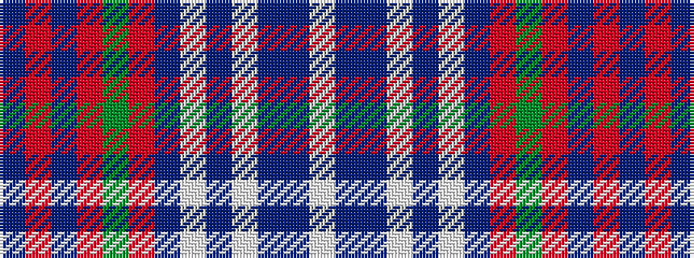

BRBRGRBWBWBBW

It is a 13 stripe tartan.

<figure class="pat-woven">

<figcaption>idealised sample</figcaption>
</figure>

## Colour Sequence



## Tartans with this colour sequence

| Tartans |
|---------------|
| [MacGillivray Dress, Janice](/setts/s13/w4b1b1w22b2w2b12r2g16r4b1r4b2~x2/)|
||
| [MacGillivray Dress, Janice (Personal](/setts/s13/lb4t1dt1lb22t2lb2dt12r2dg16r4t1r4dt2~x2/)|
||
