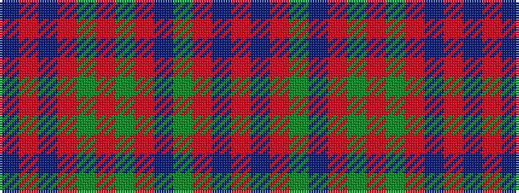

BRBRGRGRBGRBR

It is a 13 stripe tartan.

<figure class="pat-woven">

<figcaption>idealised sample</figcaption>
</figure>

## Colour Sequence



## Tartans with this colour sequence

| Tartans |
|---------------|
| [Dabney Red (Personal)](/setts/s13/r5b3r24g7db6r3g3r3g11r6db3r3b3~x2/)|
||
