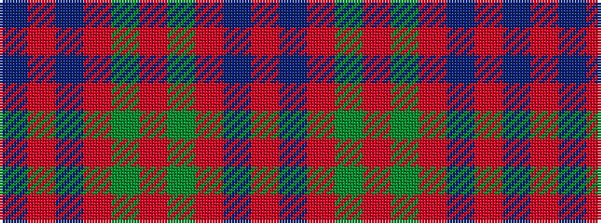

BRBRGRGRBR

It is a 10 stripe tartan.

<figure class="pat-woven">

<figcaption>idealised sample</figcaption>
</figure>

## Colour Sequence



## Tartans with this colour sequence

| Tartans |
|---------------|
| [Auld Reekie Trade Tartan](/variants/s10/db4r3db3r22g8r2~x2/)|
||
