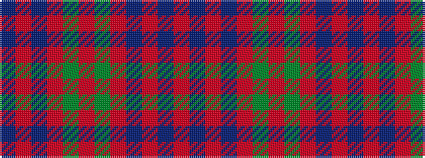

BRBRGRGRBRBR

It is a 12 stripe tartan.

<figure class="pat-woven">

<figcaption>idealised sample</figcaption>
</figure>

## Colour Sequence



## Tartans with this colour sequence

| Tartans |
|---------------|
| [MacQuarrie](/setts/s12/r1t1r6db3r1dg6r1dg6r6db1r1t1~x2/)|
||
| [MacQuarrie 4](/setts/s12/r1t1r6db3r1g6r1g6r6db1r1t1~x2/)|
||
| [MacQuarrie SM](/setts/s12/r1b1r6db3r1dg6r1dg6r6db1r1b1~x2/)|
||
| [MacQuarrie SM](/setts/s12/r1b1r6db3r1dg6r1dg6r6db1r1b1/)|
||
