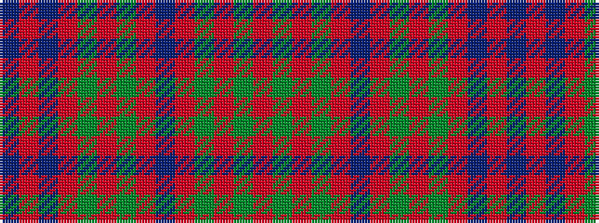

BRBRGRGRBRGRGR

It is a 14 stripe tartan.

<figure class="pat-woven">

<figcaption>idealised sample</figcaption>
</figure>

## Colour Sequence



## Tartans with this colour sequence

| Tartans |
|---------------|
| [Manx Heritage](/variants/s14/o3g19r2g2r2db10r17g2r2g2r3t2r3t3~x2/)|
||
