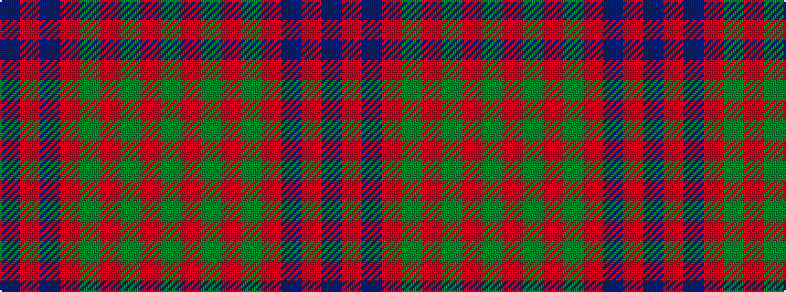

BRBRGRGRG

It is a 9 stripe tartan.

<figure class="pat-woven">

<figcaption>idealised sample</figcaption>
</figure>

## Colour Sequence



## Tartans with this colour sequence

This pattern is a design lineage: every tartan below shares one colour order, whatever its owner —
near-identical designs are grouped, the largest lineage first (#112: the pattern is a tartan's
second parent, beside its family or clan).

<table class="sett-table">
<tbody>
<tr><td><a href="/setts/db1r5db4r1g1r1g4r5g1/">Lumsden 1797</a></td></tr>
<tr><td class="sett-swatch"></td></tr>
<tr><td><a href="/variants/s9/dg1r5dg4r1dg1r1db4r5db1~x12/">Lumsden of Kintore (Clan?)</a></td></tr>
<tr><td class="sett-swatch"></td></tr>
<tr><td><a href="/variants/s9/g10r1g1r1g1r4db12r1db2~x2/">Unidentified Portrait</a></td></tr>
<tr><td class="sett-swatch"></td></tr>
</tbody>
</table>

