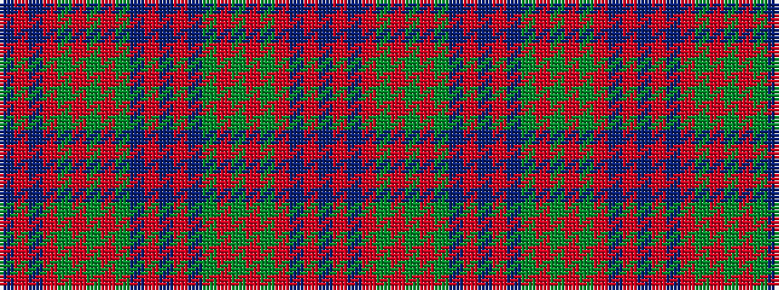

BRBRGRGRGBRBRBGRGRGRBRB

It is a 23 stripe tartan.

<figure class="pat-woven">

<figcaption>idealised sample</figcaption>
</figure>

## Colour Sequence



## Tartans with this colour sequence

| Tartans |
|---------------|
| [Fraser](/setts/s23/db10r1db1r1g10r13g2r13g10db10r1db1r1db10g10r13g2r13g10r1db1r1db5~x4/)|
||
