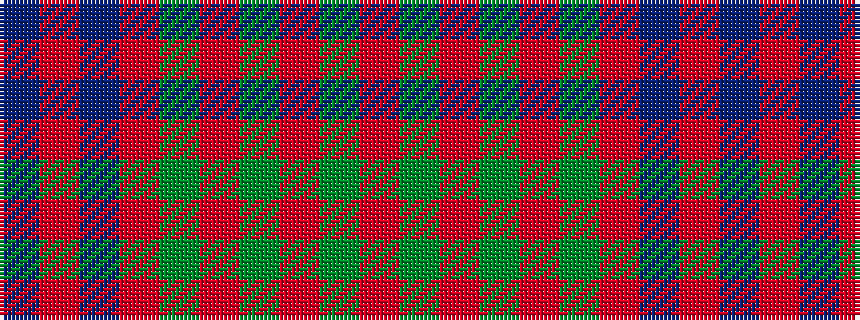

BRBRGRGRGR

It is a 10 stripe tartan.

<figure class="pat-woven">

<figcaption>idealised sample</figcaption>
</figure>

## Colour Sequence



## Tartans with this colour sequence

| Tartans |
|---------------|
| [Connacht](/variants/s10/o64g6o2g3o2g6o64dr2o2dr6~x2/)|
||
