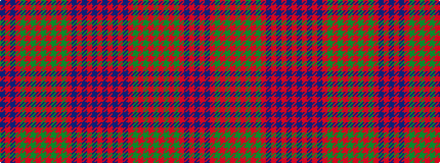

BRBRGRGRGRGRGRBRBRBR

It is a 20 stripe tartan.

<figure class="pat-woven">

<figcaption>idealised sample</figcaption>
</figure>

## Colour Sequence



## Tartans with this colour sequence

| Tartans |
|---------------|
| [Ross](/variants/s20/db18r2db18r18dg2r4dg2r18dg18r2dg18r2dg18r18db1r1db2r1db1r18~x2/)|
||
| [Ross 3](/variants/s20/db18r2db18r18g2r4g2r18g18r2g18r2g18r18db1r1db2r1db1r18~x2/)|
||
