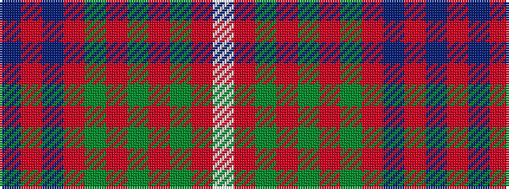

BRBRGRGRGRW

It is a 11 stripe tartan.

<figure class="pat-woven">

<figcaption>idealised sample</figcaption>
</figure>

## Colour Sequence



## Tartans with this colour sequence

| Tartans |
|---------------|
| [North Berwick (Dance)](/setts/s11/dt10r2dt10r10dg2r2dg2r2dg10r1w2~x4/)|
||
