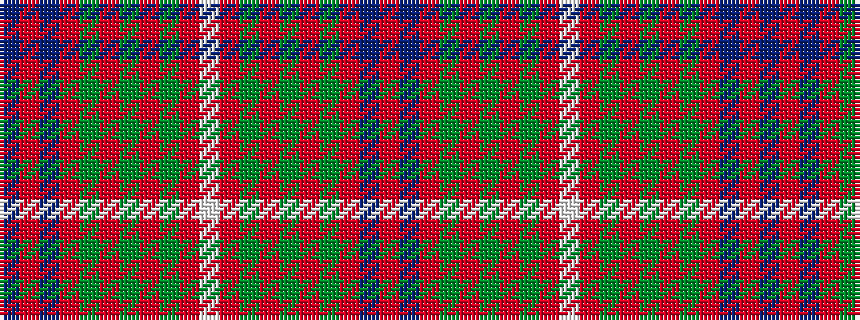

BRBRGRGRGRWRGRGRGRBR

It is a 20 stripe tartan.

<figure class="pat-woven">

<figcaption>idealised sample</figcaption>
</figure>

## Colour Sequence



## Tartans with this colour sequence

| Tartans |
|---------------|
| [North Berwick Pipe Band District Tartan Tartan Number: 2342. Earliest known date: 1990 Designed by Donald Fraser for the North Berwick Pipe Band dancers for their visit to Maine USA in 1990. The Pipe Band itself normally wears McKenzie. See products available Copyright © Blair Urquhart, Comrie, 2015](/setts/s20/dt10r2dt10r10dg2r2dg2r2dg10r1w2~x4/)|
||
