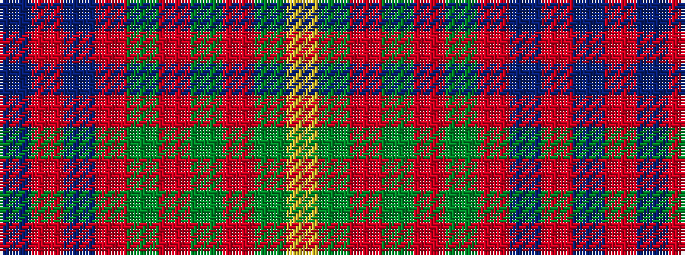

BRBRGRGRGY

It is a 10 stripe tartan.

<figure class="pat-woven">

<figcaption>idealised sample</figcaption>
</figure>

## Colour Sequence



## Tartans with this colour sequence

| Tartans |
|---------------|
| [Connacht](/setts/s10/lo64g4o1g4o1g4o64dr2o2dr8~x2/)|
||
| [Connaught Irish District Tartan Tartan Number: 2064. Earliest known date: Not known A tartan from the West of Ireland. See products available Copyright © Blair Urquhart, Comrie, 2015](/setts/s10/ly32g2m1g2m1g2m32do1m1do4~x2/)|
||
