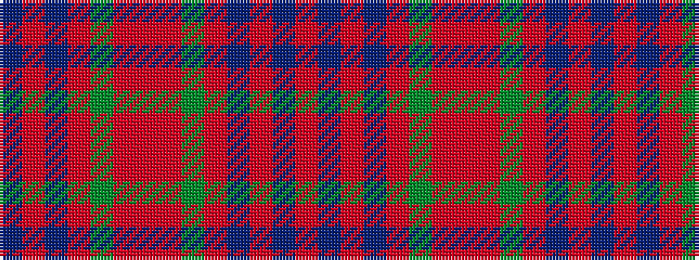

BRBRGRRRGRBRBR

It is a 14 stripe tartan.

<figure class="pat-woven">

<figcaption>idealised sample</figcaption>
</figure>

## Colour Sequence



## Tartans with this colour sequence

| Tartans |
|---------------|
| [MacQuarrie #2](/setts/s14/r4t2r50db26r10dg44ri4r10ri4dg44r51db2r4t2~x2/)|
||
| [MacQuarrie 1](/setts/s14/ri4t2ri50db26ri10g44r4ri10r4g44ri51db2ri4t2~x2/)|
||
