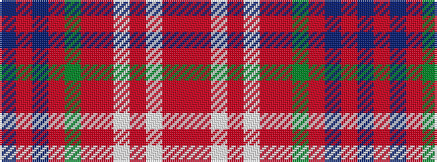

BRBRGRRWRWRR

It is a 12 stripe tartan.

<figure class="pat-woven">

<figcaption>idealised sample</figcaption>
</figure>

## Colour Sequence



## Tartans with this colour sequence

| Tartans |
|---------------|
| [Scobie (Blackford)](/setts/s12/p1r1p1r6g26m14r20lt1r1lt1r2m1~x2/)|
||
