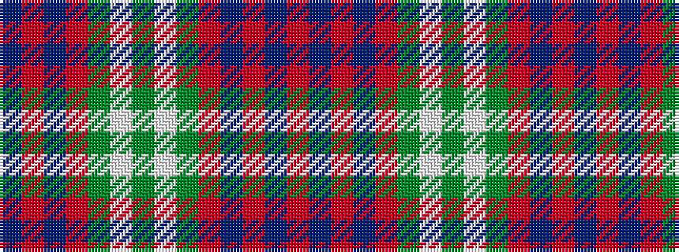

BRBRGWGWGRBRBR

It is a 14 stripe tartan.

<figure class="pat-woven">

<figcaption>idealised sample</figcaption>
</figure>

## Colour Sequence



## Tartans with this colour sequence

| Tartans |
|---------------|
| [Perth, (Duke of.. )](/variants/s14/db30r14db2r14g20w1g2w1g20r44db4r10t1r4~x2/)|
||
