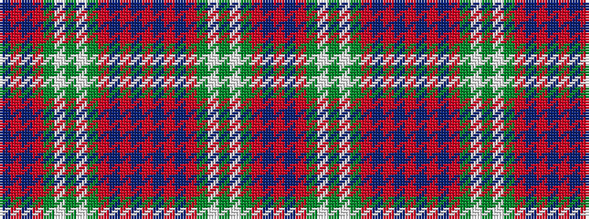

BRBRGWGWGRBRBRBRBRGWGWGRBR

It is a 26 stripe tartan.

<figure class="pat-woven">

<figcaption>idealised sample</figcaption>
</figure>

## Colour Sequence



## Tartans with this colour sequence

| Tartans |
|---------------|
| [Unnamed C18th - Duke of Perth](/setts/s26/db30r14db2r14g20w1g2w1g20r44db4r10t1r4~x2/)|
||
