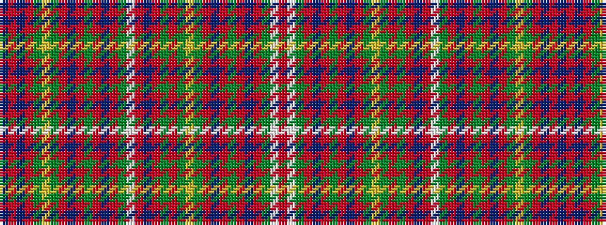

BRBRGYGRBRGRBRGWRBRGRGYGRBRGRBRGWR

It is a 34 stripe tartan.

<figure class="pat-woven">

<figcaption>idealised sample</figcaption>
</figure>

## Colour Sequence



## Tartans with this colour sequence

| Tartans |
|---------------|
| [Unidentified 18th Centuary plain weave](/variants/s34/db19r2db2r20dg2ly1dg2r2db18r2dg3r2db2r22dg3w1r3db17r2dg2r24dg2ly1dg2r2db19r3dg3r2db2r21dg3w1r3~x2/)|
||
| [Unidentified, 18th C plain weave](/variants/s34/db19r2db2r20g2ly1g2r2db18r2g3r2db2r22g3w1r3db17r2g2r24g2ly1g2r2db19r3g3r2db2r21g3w1r3~x2/)|
||
