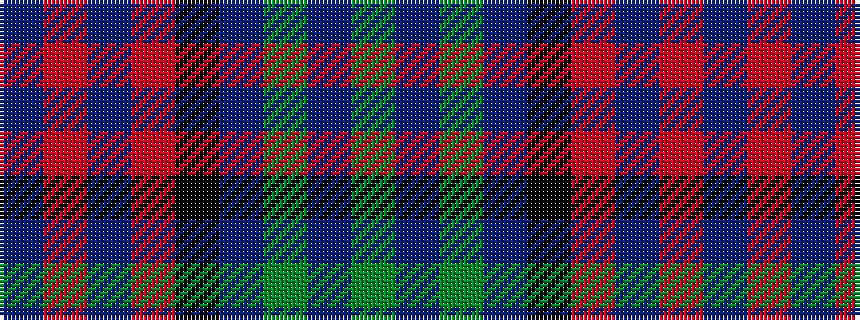

BRBRKBGBG

It is a 9 stripe tartan.

<figure class="pat-woven">

<figcaption>idealised sample</figcaption>
</figure>

## Colour Sequence



## Tartans with this colour sequence

| Tartans |
|---------------|
| [Alexander Hunting (Name)](/setts/s9/db12r2db4r4k15db4g4db2g12~x2/)|
||
