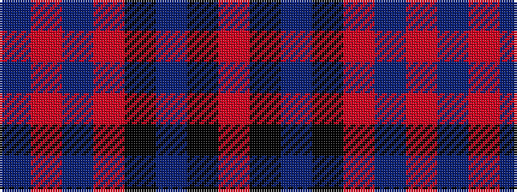

BRBRKBKR

It is a 8 stripe tartan.

<figure class="pat-woven">

<figcaption>idealised sample</figcaption>
</figure>

## Colour Sequence



## Tartans with this colour sequence

| Tartans |
|---------------|
| [Kilbranan Sound (Personal)](/variants/s8/ni8r11ni28r4k17n1k7r2~x2/)|
||
