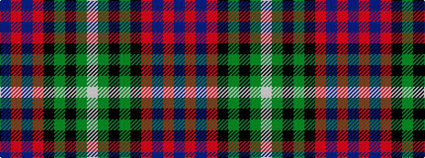

BRBRKGKGW

It is a 9 stripe tartan.

<figure class="pat-woven">

<figcaption>idealised sample</figcaption>
</figure>

## Colour Sequence



## Tartans with this colour sequence

| Tartans |
|---------------|
| [Redgate Htg #1 (Name)](/variants/s9/db1r4db12r1k7y12k7dy21lb1~x2/)|
||
