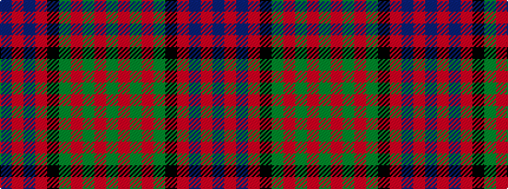

BRBRKGRGRG

It is a 10 stripe tartan.

<figure class="pat-woven">

<figcaption>idealised sample</figcaption>
</figure>

## Colour Sequence



## Tartans with this colour sequence

| Tartans |
|---------------|
| [Cameron](/variants/s10/db7r3db9r2k10g9r3g2r2g7~x2/)|
||
| [Cameron (altered by weaver)](/variants/s10/dg7r2dg2r3dg9k10r2db9r3db7~x2/)|
||
