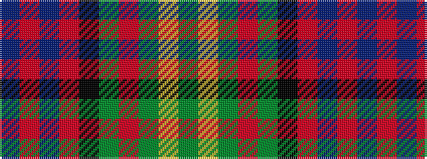

BRBRKGRGYG

It is a 10 stripe tartan.

<figure class="pat-woven">

<figcaption>idealised sample</figcaption>
</figure>

## Colour Sequence



## Tartans with this colour sequence

| Tartans |
|---------------|
| [Biskup](/setts/s10/db12r4db18r2k19g18r4g3ly2g8~x2/)|
||
| [Biskup (Personal)](/setts/s10/db12r4db18r2k19g18r4g3lo2g8~x2/)|
||
