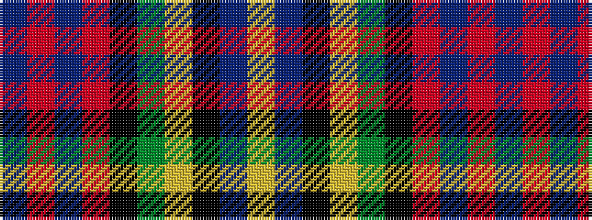

BRBRKGYKBY

It is a 10 stripe tartan.

<figure class="pat-woven">

<figcaption>idealised sample</figcaption>
</figure>

## Colour Sequence



## Tartans with this colour sequence

| Tartans |
|---------------|
| [Wisconsin (US State)](/variants/s10/n11r3n2o3k12dg20ly2k12n11lo3~x2/)|
||
