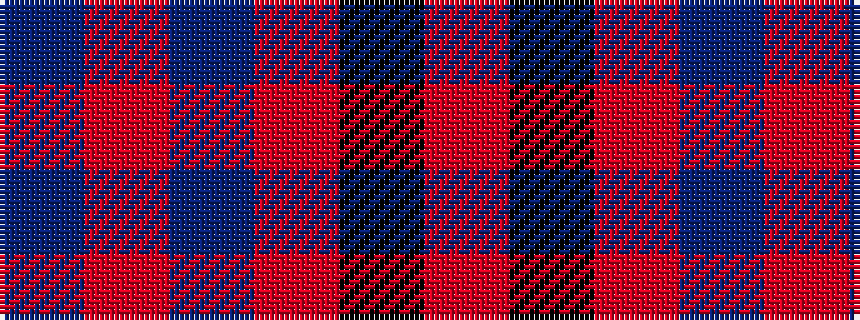

BRBRKR

It is a 6 stripe tartan.

<figure class="pat-woven">

<figcaption>idealised sample</figcaption>
</figure>

## Colour Sequence



## Tartans with this colour sequence

| Tartans |
|---------------|
| [MacGregor, Modern](/setts/s6/db18r9db2r3k1o1~x4/)|
||
