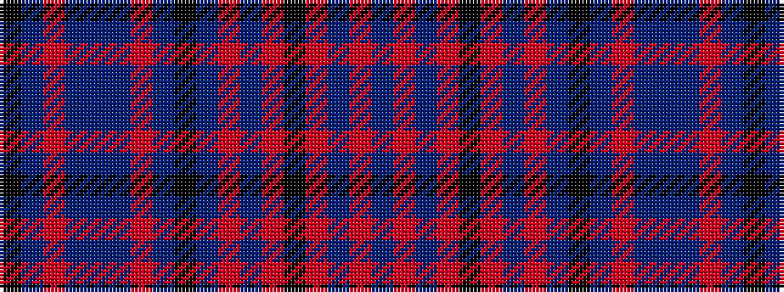

BRBRKRBRBKBRBBBRBK

It is a 18 stripe tartan.

<figure class="pat-woven">

<figcaption>idealised sample</figcaption>
</figure>

## Colour Sequence



## Tartans with this colour sequence

| Tartans |
|---------------|
| [Asile](/variants/s18/k3dp1o2dp1dt6dp1o2dp1k16dt16o1dp2o1k6o1dp2o1dt3~x2/)|
||
