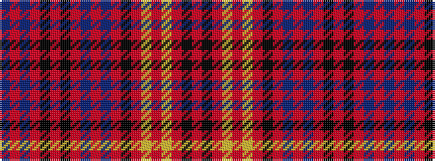

BRBRKRKRBRBRKRYRYRKR

It is a 20 stripe tartan.

<figure class="pat-woven">

<figcaption>idealised sample</figcaption>
</figure>

## Colour Sequence



## Tartans with this colour sequence

| Tartans |
|---------------|
| [Washington Stockmens (Corporate)](/variants/s20/db4o3db4o19k2o3k2o12db4o3db4o3k1o2ly1o2ly1o2k1o3~x4/)|
||
