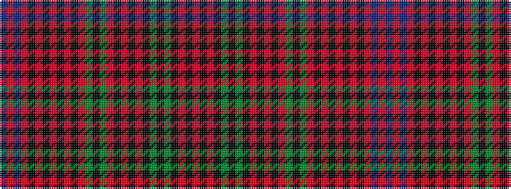

BRBRKRKRKRKRGKGRKRKRKGKGKRKR

It is a 28 stripe tartan.

<figure class="pat-woven">

<figcaption>idealised sample</figcaption>
</figure>

## Colour Sequence



## Tartans with this colour sequence

| Tartans |
|---------------|
| [MacInroy](/variants/s28/r18k3r3k11g9k2g9k11r2k11r3k3r9g2k3g2r9k3r3k11r2k11r3k3r18db2r3db2~x2/)|
||
| [MacInroy #2](/variants/s28/r18k3r3k11dg9k2dg9k11r2k11r3k3r9dg2k3dg2r9k3r3k11r2k11r3k3r18db2r3db2~x2/)|
||
