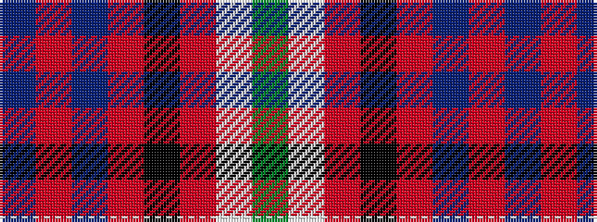

BRBRKRWG

It is a 8 stripe tartan.

<figure class="pat-woven">

<figcaption>idealised sample</figcaption>
</figure>

## Colour Sequence



## Tartans with this colour sequence

| Tartans |
|---------------|
| [MacNeil 3](/setts/s8/g45w2r3k15r3db15r3db15~x2/)|
||
