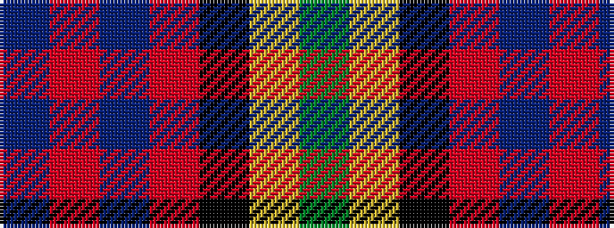

BRBRKYG

It is a 7 stripe tartan.

<figure class="pat-woven">

<figcaption>idealised sample</figcaption>
</figure>

## Colour Sequence



## Tartans with this colour sequence

| Tartans |
|---------------|
| [MacDonald (Flora.. )](/variants/s7/dg17ly2k14r2db9r2db10~x2/)|
||
| [MacDonald, (Flora.. )](/variants/s7/g17ly2k14r2db9r2db10~x2/)|
||
