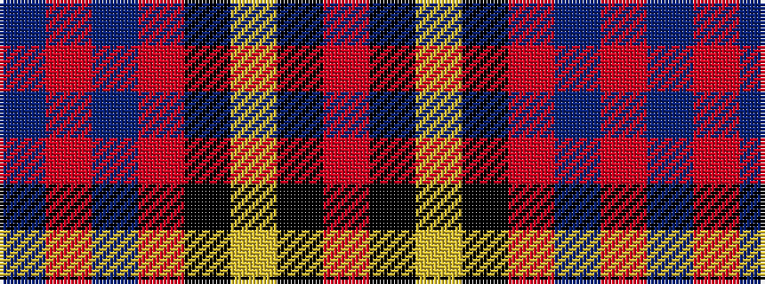

BRBRKYKR

It is a 8 stripe tartan.

<figure class="pat-woven">

<figcaption>idealised sample</figcaption>
</figure>

## Colour Sequence



## Tartans with this colour sequence

| Tartans |
|---------------|
| [Leslie Dress](/setts/s8/r4k6ly1k6r4db16r32db1~x2/)|
||
