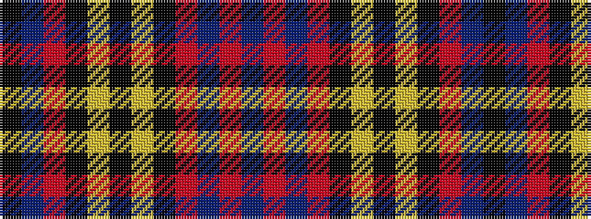

BRBRKYKYKRBK

It is a 12 stripe tartan.

<figure class="pat-woven">

<figcaption>idealised sample</figcaption>
</figure>

## Colour Sequence



## Tartans with this colour sequence

| Tartans |
|---------------|
| [Johnnie Walker (2003) (Corporate)](/variants/s12/k6db4r11k36lo5k5lo5k8r30db10r8db4/)|
||
