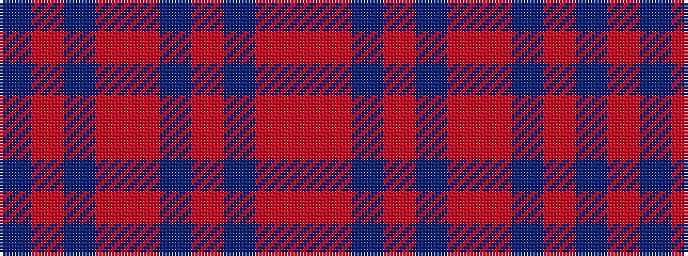

BRBRRBRBRR

It is a 10 stripe tartan.

<figure class="pat-woven">

<figcaption>idealised sample</figcaption>
</figure>

## Colour Sequence



## Tartans with this colour sequence

| Tartans |
|---------------|
| [Harry (Welsh Name)](/setts/s10/dt6o3dt3o15r7dt7r5dt17r46o4/)|
||
