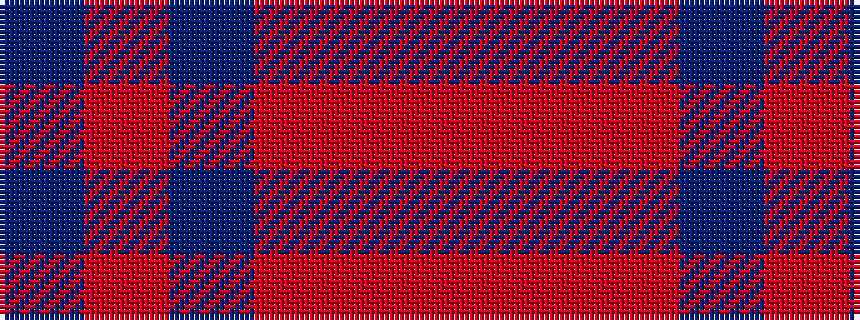

BRBRRR

It is a 6 stripe tartan.

<figure class="pat-woven">

<figcaption>idealised sample</figcaption>
</figure>

## Colour Sequence



## Tartans with this colour sequence

| Tartans |
|---------------|
| [Cypress](/setts/s6/do2m2do17o17o2o2~x4/)|
||
| [Eglington](/setts/s6/dt2m2dt17r17o2r2~x4/)|
||
