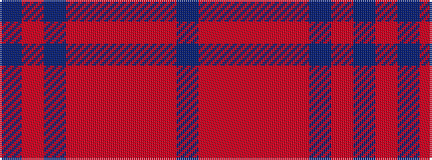

BRBRRRRRB

It is a 9 stripe tartan.

<figure class="pat-woven">

<figcaption>idealised sample</figcaption>
</figure>

## Colour Sequence



## Tartans with this colour sequence

| Tartans |
|---------------|
| [Breckon](/setts/s9/db3o1db14r14o1r1o1r1db2~x4/)|
||
