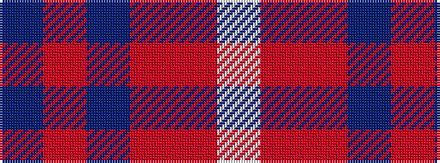

BRBRRW

It is a 6 stripe tartan.

<figure class="pat-woven">

<figcaption>idealised sample</figcaption>
</figure>

## Colour Sequence



## Tartans with this colour sequence

| Tartans |
|---------------|
| [McIntosh, Georgina (Personal)](/variants/s6/db9r1db2r1r4w1~x12/)|
||
