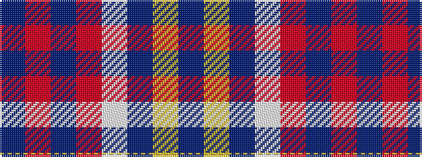

BRBRWBYB

It is a 8 stripe tartan.

<figure class="pat-woven">

<figcaption>idealised sample</figcaption>
</figure>

## Colour Sequence



## Tartans with this colour sequence

| Tartans |
|---------------|
| [Cairngorms National Park](/variants/s8/dp57m5dp2m8lb2dp3ly2dp14~x2/)|
||
