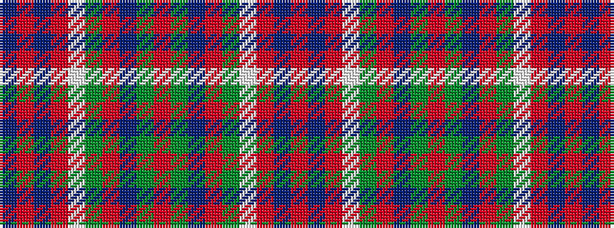

BRBRWGRBGRGBRGWRBR

It is a 18 stripe tartan.

<figure class="pat-woven">

<figcaption>idealised sample</figcaption>
</figure>

## Colour Sequence



## Tartans with this colour sequence

| Tartans |
|---------------|
| [Unnamed C18/19th - Antigonish (A)](/variants/s18/r26y6dt26r2y26w1r6dt2r6dt13~x2/)|
||
