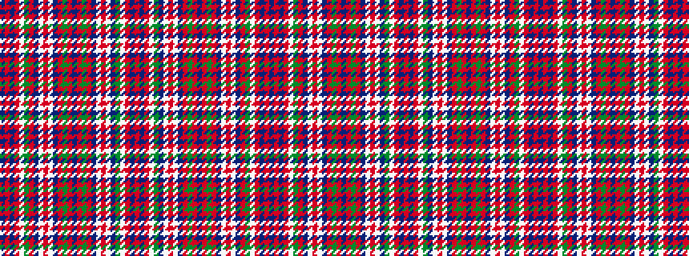

BRBRWGRBWRWBRGRBRGRBWRWBGWRBR

It is a 29 stripe tartan.

<figure class="pat-woven">

<figcaption>idealised sample</figcaption>
</figure>

## Colour Sequence



## Tartans with this colour sequence

| Tartans |
|---------------|
| [Unnamed C18/19th - Antigonish (A) #2](/variants/s29/dt13r6dt2r6w1y26r2dt26w1r26w1dt6r2y2r2dt13r2y2r2dt6w1r26w1dt26y26w1r6dt2r6~x2/)|
||
