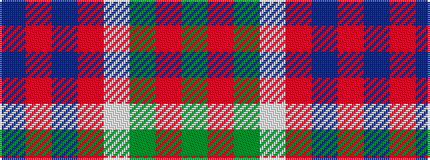

BRBRWGRG

It is a 8 stripe tartan.

<figure class="pat-woven">

<figcaption>idealised sample</figcaption>
</figure>

## Colour Sequence



## Tartans with this colour sequence

| Tartans |
|---------------|
| [Bannockbane Brown #1](/setts/s8/do2r2do15r1w10dy15r2dy2~x2/)|
||
| [Bannockbane, Modern Silver](/setts/s8/db3o2db18o1w10y18o2y3~x2/)|
||
