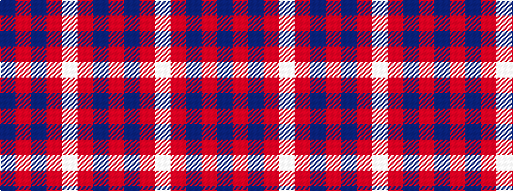

BRBRWRBR

It is a 8 stripe tartan.

<figure class="pat-woven">

<figcaption>idealised sample</figcaption>
</figure>

## Colour Sequence



## Tartans with this colour sequence

| Tartans |
|---------------|
| [Edinburgh Marketing](/variants/s8/db6r1db1r2w1r2db1r3~x4/)|
||
| [Edinburgh Marketing](/variants/s8/db38r6db6r9w5r12db8r16/)|
||
| [Edinburgh TIC (Corporate)](/variants/s8/db32r3db3r4w3r5db4r7~x2/)|
||
