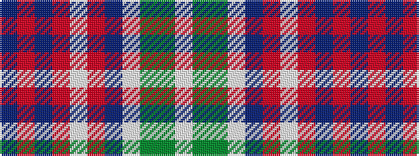

BRBRWRBWGGW

It is a 11 stripe tartan.

<figure class="pat-woven">

<figcaption>idealised sample</figcaption>
</figure>

## Colour Sequence



## Tartans with this colour sequence

| Tartans |
|---------------|
| [Dallas (Clan)](/setts/s11/b79o2b10o6w2o6b10w2g10g6w2~x2/)|
||
| [Dallas (Lochcarron) (Personal)](/setts/s11/b79o2b10o5w2o5b10w2dg8g6w2~x2/)|
||
