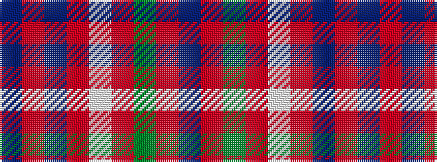

BRBRWRGRB

It is a 9 stripe tartan.

<figure class="pat-woven">

<figcaption>idealised sample</figcaption>
</figure>

## Colour Sequence



## Tartans with this colour sequence

| Tartans |
|---------------|
| [Nethybridge](/variants/s9/db2r49dg51r9w2r9db51r49db2~x2/)|
||
| [Unidentified 20](/variants/s9/db2r49db51r9w2r9g51r49db2~x2/)|
||
