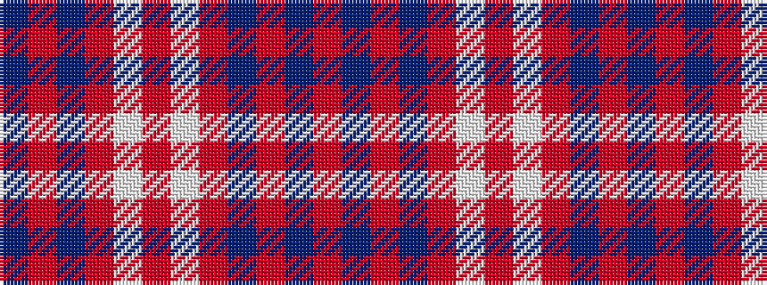

BRBRWRWRBRBR

It is a 12 stripe tartan.

<figure class="pat-woven">

<figcaption>idealised sample</figcaption>
</figure>

## Colour Sequence



## Tartans with this colour sequence

| Tartans |
|---------------|
| [Bon Accord Corporate Com Tartan](/variants/s12/dt25r3dt3r17w3r6w3r17dt3r3dt25r3~x2/)|
||
