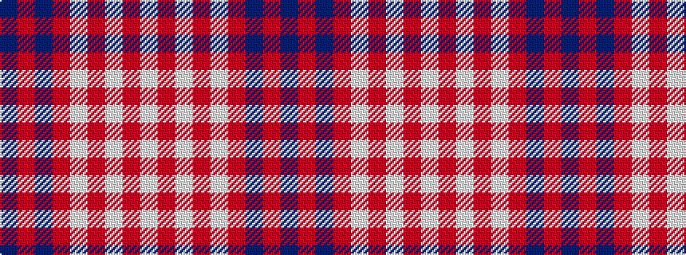

BRBRWRWRW

It is a 9 stripe tartan.

<figure class="pat-woven">

<figcaption>idealised sample</figcaption>
</figure>

## Colour Sequence



## Tartans with this colour sequence

| Tartans |
|---------------|
| [Titanium (Fashion)](/variants/s9/n44o8n8o22lb4o4lb11o2lbi2~x2/)|
||
