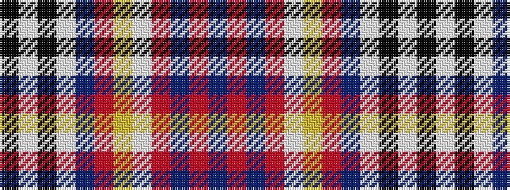

BRBRWYRBWKWK

It is a 12 stripe tartan.

<figure class="pat-woven">

<figcaption>idealised sample</figcaption>
</figure>

## Colour Sequence



## Tartans with this colour sequence

| Tartans |
|---------------|
| [Allandale Blue Dress Tartan Tartan Number: 8453. Earliest known date: Threadcount and colours aren't 100% original. Generated manually. See products available Copyright © Blair Urquhart, Comrie, 2015](/setts/s12/k3w2k1w40t17m5ly3w2m9t1m2t3~x2/)|
||
