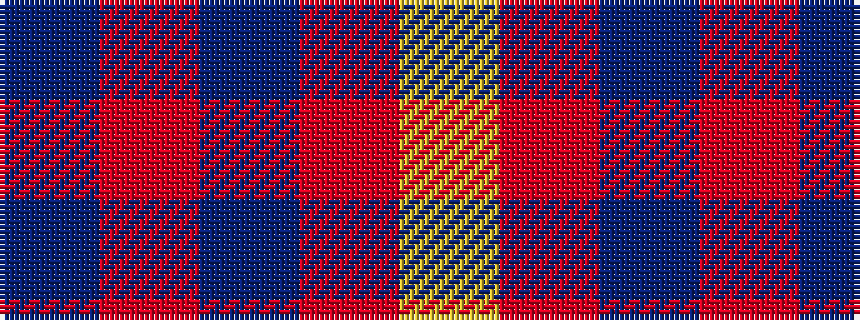

BRBRY

It is a 5 stripe tartan.

<figure class="pat-woven">

<figcaption>idealised sample</figcaption>
</figure>

## Colour Sequence



## Tartans with this colour sequence

| Tartans |
|---------------|
| [Brooks Brothers Tattersall Red](/variants/s5/db1r9db2r9lo1~x4/)|
||
| [Callum (Buchan) (Name)](/variants/s5/n7r1dt6r8lr1~x8/)|
||
| [Hamilton](/variants/s5/db6r1db6r9lr1~x2/)|
||
