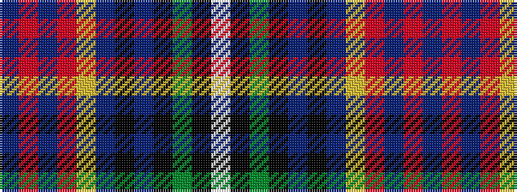

BRBRYBKBKGKW

It is a 12 stripe tartan.

<figure class="pat-woven">

<figcaption>idealised sample</figcaption>
</figure>

## Colour Sequence



## Tartans with this colour sequence

| Tartans |
|---------------|
| [Celtic Nations](/variants/s12/db3r2db2r35ly2db3k2db5k4g13k1w3~x2/)|
||
| [Celtic Nations (Fashion)](/variants/s12/db3r2db2r35lo2db3k2db5k4g13k1w3~x2/)|
||
