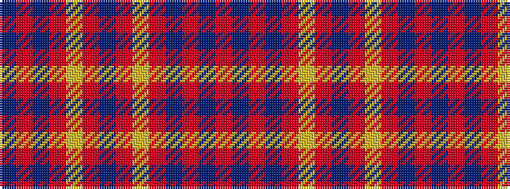

BRBRYRBRYRBRBR

It is a 14 stripe tartan.

<figure class="pat-woven">

<figcaption>idealised sample</figcaption>
</figure>

## Colour Sequence



## Tartans with this colour sequence

| Tartans |
|---------------|
| [Munro (Culloden)](/variants/s14/db6r8db1r2ly5r5db5r5ly1r2db1r2db1r6~x2/)|
||
| [Munro Old Artifact Tartan](/variants/s14/db12r16db2r4ly10r10db10r10ly2r4db2r4db1r12/)|
||
