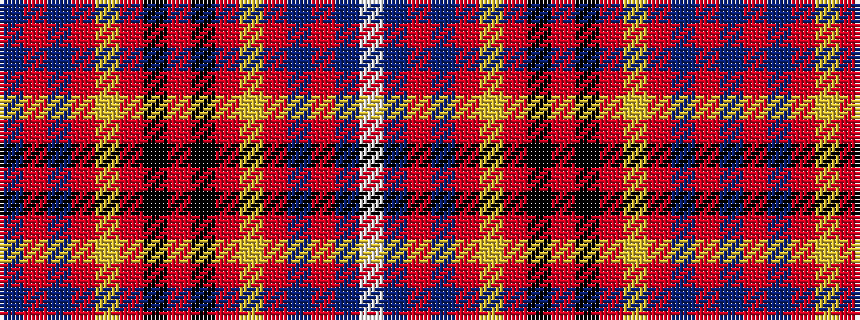

BRBRYRKRKRYRBRBW

It is a 16 stripe tartan.

<figure class="pat-woven">

<figcaption>idealised sample</figcaption>
</figure>

## Colour Sequence



## Tartans with this colour sequence

| Tartans |
|---------------|
| [Stenhousemuir Football Club](/variants/s16/db3r3db14r60ly3r4k2r6k2r4ly3r60db14r3db3w1~x2/)|
||
