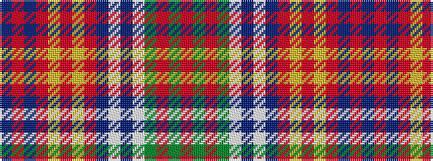

BRBRYRYRBWBWGRGR

It is a 16 stripe tartan.

<figure class="pat-woven">

<figcaption>idealised sample</figcaption>
</figure>

## Colour Sequence



## Tartans with this colour sequence

| Tartans |
|---------------|
| [Riley-Utter Union (Personal)](/variants/s16/b13r2b9r4ly1r4ly2r5do3w5do6w2g7r2g13r7~x2/)|
||
